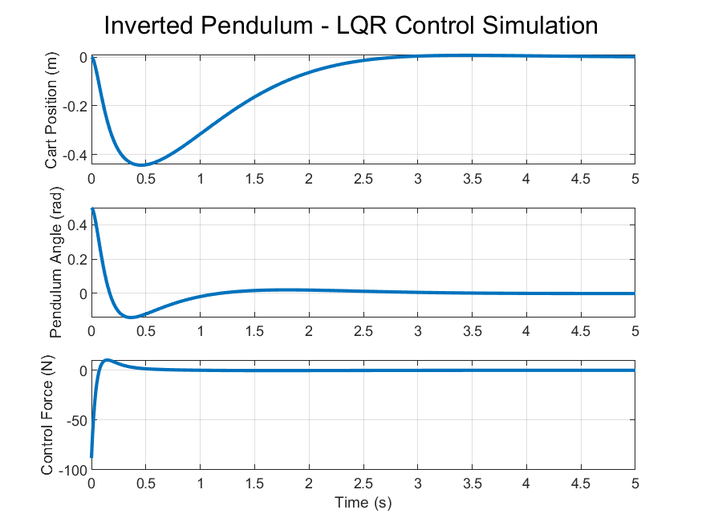
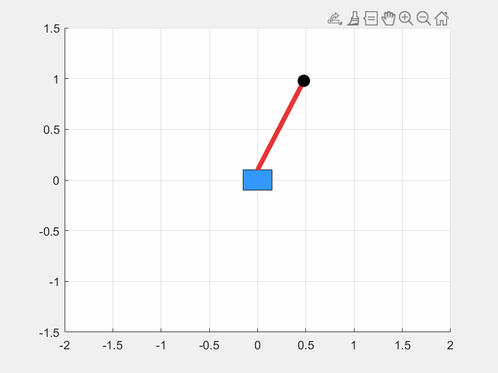

# Inverted Pendulum - LQR Control Simulation

This project simulates an inverted pendulum on a cart using a **linearized state-space model** and an **LQR (Linear Quadratic Regulator)** controller to stabilize the system. 
It includes dynamic plotting of the cart position and pendulum angle, as well as an animation of the balancing motion.

---

## System Overview

The system includes:
- A cart of mass \( M = 1 \) kg
- A pendulum of mass \( m = 0.1 \) kg and length \( l = 0.5 \) m
- Gravity \( g = 9.81 \) m/s²
  
Arbitrary values chosen to best simulate a simple system.
It is modeled using the linearized dynamics around the upright equilibrium point.

---

## LQR Controller

The controller minimizes the cost function:

J = int_0^\infty (x^T Q x + u^T R u)\, dt

With:
-  Q = diag(10, 1, 100, 1) to prioritize position and pendulum angle
- R = 0.01 to allow moderate control effort

---

## Simulation Results

### Step Response

- The cart returns to center
- The pendulum stabilizes upright
- The control input smoothly reduces to 0

---

### Animation

This animation shows the pendulum balancing itself back to vertical after an initial angle disturbance.

---

## How to Run

1. Open the `code/inverted_pendulum_lqr.m` script in MATLAB
2. Run the script
3. Outputs:
   - Time-domain plots of the system states and control input
   - Optional: pendulum-cart animation
   - All figures saved automatically to `/figures`

---

## Demonstrated

- Linearization of nonlinear dynamic systems
- State-space modeling
- Optimal control using LQR
- MATLAB simulation and plotting
- Simple visualization and animation of dynamics

